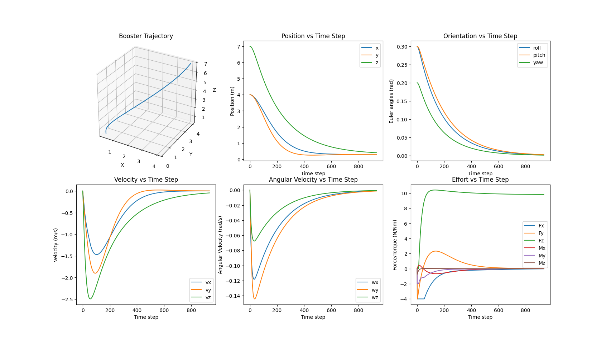
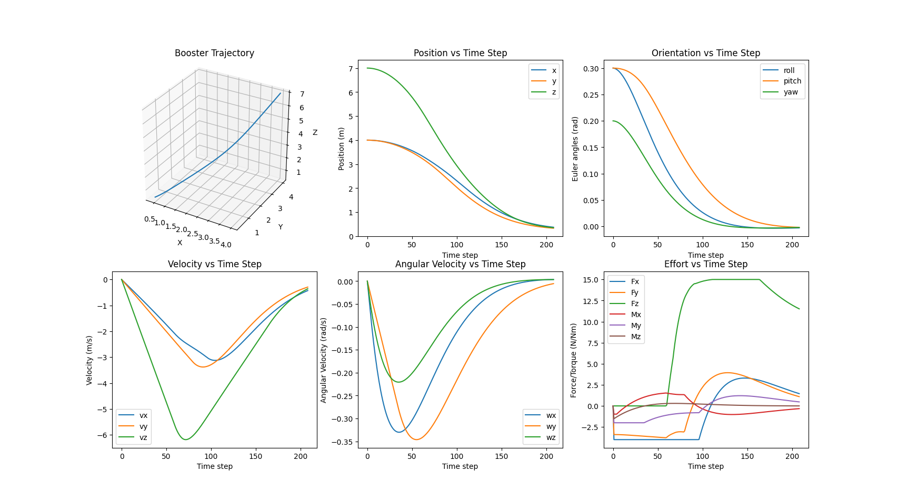

# SpaceX booster landing

This project simulates the return process of a spacecraft booster to its initial launch platform. The booster is controlled descent and align precisely into the chopstick mechanism. The simulation incorporates Linear Quadratic Regulator (LQR) and Model Predictive Controller (MPC) to achieve optimal trajectory of during its descent phases. 

_Read [Project Report](Final_Project_Report.pdf) to get detail information_

<!--  -->


## Install
Project works in python 3.10

1. Clone the github 

2. Install requirement libraries. 
    ```
    pip install -r requirement.txt
    ```

## Run Simulation
- Run file __scripts/simulation.py__ to play simulation.
- For LQR controller 
    ```
    python scripts/simulation.py --controller 'LQR'
    ```
- For MPC controller 
    ```
    python scripts/simulation.py --controller 'MPC'
    ```

## Modify Controller
To customize the behavior of the controller for each state, you can modify the cost matrices Q and R. 

### 1. LQR Controller
- Matlab file [LQR_tunning.m](scripts/LQR_tunning.m) will calculate K = [Kp, Kd] according to given Q and R.
- The control result is shown in the following figure


### 2. MPC Controller
- Tune time step dT and horizontal prediction N for each situation 
- The control result is shown in the following figure
